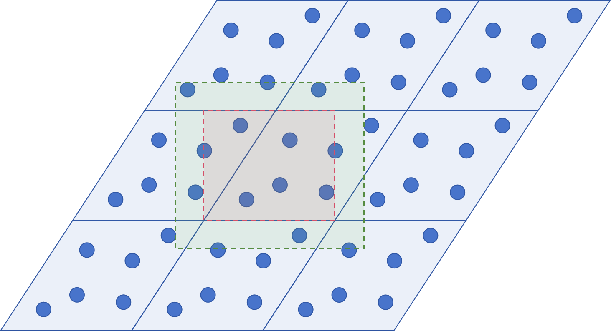

# alffmc
Atom Linkage Finder for Molecular Crystal

## 使用

这个算法只是一个函数，仅使用了numpy，你可以复制到你现有的代码中使用。

## 算法简介

带有对称性和周期性边界条件的体系中，寻找碰撞的快速方法。

在传统的方法中，我们需要计算整个超胞和单位胞中的原子的平方差，这样的计算相对比较慢。

在这个新方法中，我们只需要计算绿色框线部分和红色框线部分之间的平方差，这个剪枝可以大幅提高计算速度，新算法的python代码效率甚至能比传统算法的C代码更快。

